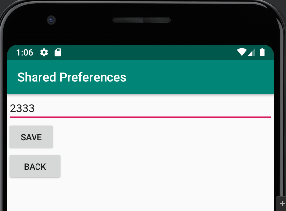
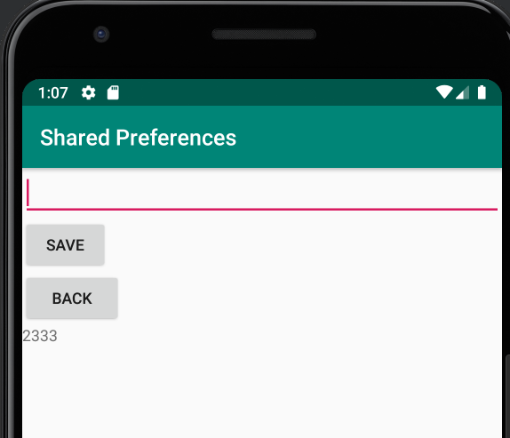
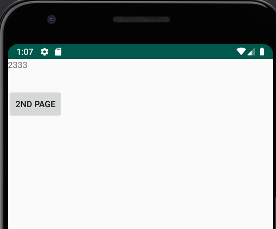

# Rapport

**Skriv din rapport här!**


## Följande grundsyn gäller dugga-svar:

Jag har skapat en sidan som heter SecondActivity, i denna sidan har jag ett EditText, 2 button en som kan spara texten och en som kan går till baka till första sidan. Och har en TextView som kan visa ut den sparade texten.
Jag har skapat ett Activity som heter Shared Preferences, man detta gör ingenting i min kod, så jag tog bort det.
I activity_main har jag en TextView och en button, textView ska visa den sparande texen som skrevs i SecondActivity sidan, och button är till SecondActivity sidan.
Jag har lägga ett extra string i strings.xml, Eftersom jag refererar till en strängresurs som heter save.
Jag har gjort samma sak i SecondActivitys button kod, bara byta SecondActivity till MainActivity.


```
 Button button = findViewById(R.id.start_second_activity); //Hitta button id som är start_second_activity //
 button.setOnClickListener(new View.OnClickListener() {
            @Override
            public void onClick(View view) {
                Intent intent = new Intent(MainActivity.this, SecondActivity.class); //När man klicka på knappen visa SecondActivity sidan//
                startActivity(intent);//Starta//
            }
        });
        
  // Get a reference to the shared preference
        myPreferenceRef= getSharedPreferences("MyPreferenceName",MODE_PRIVATE);
        myPreferenceEditor= myPreferenceRef.edit();
        
   // Save a preference in MainActivity
        TextView prefTextRef=new TextView(this);
        prefTextRef=(TextView)findViewById(R.id.prefText);
        prefTextRef.setText(myPreferenceRef.getString("MyAppPreferenceString", "No preference found."));
   
   // Save a preference in SecondActivity     
    public void savePref(View v){
            // Get the text
            EditText newPrefText=new EditText(this);
            newPrefText=(EditText)findViewById(R.id.settingseditview);

            // Store the new preference
            myPreferenceEditor.putString("MyAppPreferenceString", newPrefText.getText().toString());
            myPreferenceEditor.apply();

            // Display the new preference
            TextView prefTextRef=new TextView(this);
            prefTextRef=(TextView)findViewById(R.id.prefText);
            prefTextRef.setText(myPreferenceRef.getString("MyAppPreferenceString", "No preference found."));

            // Clear the EditText
            newPrefText.setText("");
        }
```






